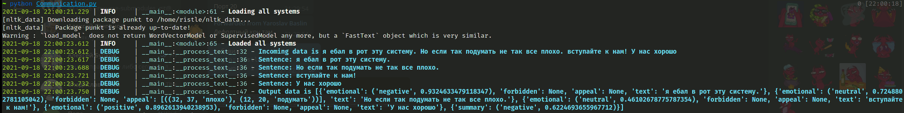
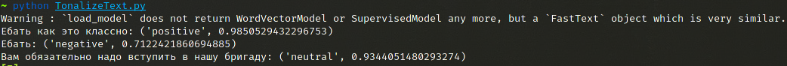
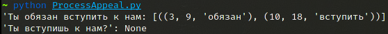
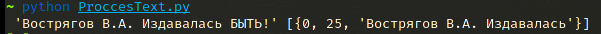

# Check text for law

## Install

```
pip install -r requirements.txt --user
python -m dostoevsky download fasttext-social-network-model
python -c "import nltk; nltk.download('punkt')"
```

```
python setup.py install
```

## First steps

This is needed for data extraction from the government's site

```
wget https://minjust.gov.ru/uploaded/files/exportfsm.csv -P data/
cd check4fsm; 
python prepareData.py
```

This will generate `data/NER.json` which consist all forbidden information.

## Usage 

Here some examples of using this repo.

### Summary information about everything



### Get Emotions in test 



### Have appeal or not



### Have forbidden info or not




